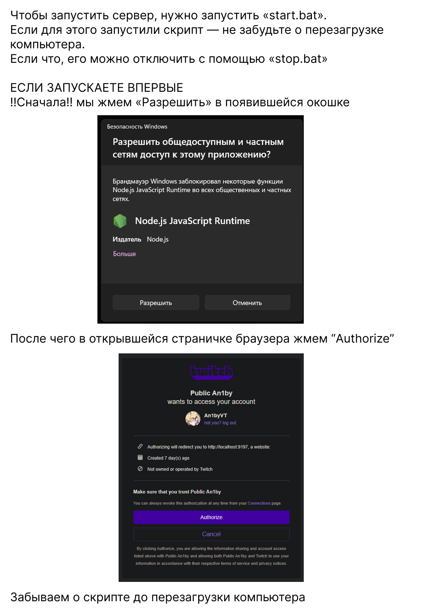
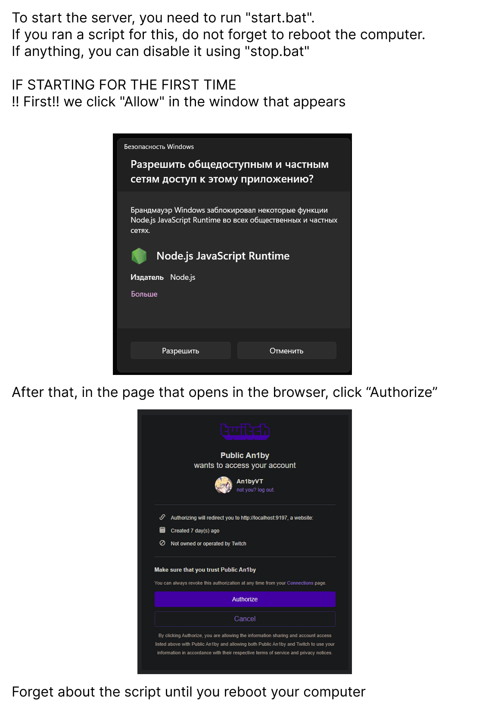

# twitch-avatar-server

## Инструкция на русском



Если у вас после выполнения инструкции не берутся аватарки:
1. Открываем https://dev.twitch.tv/console
2. Справа вкладка "Заявки" -> "Подать заявку"
   2.1. Название - любое
   2.2. OAuth Redirect URL - "http://localhost:9197/auth/" (без кавычек)
   2.3. Категория - любая
   2.4. Тип клиента - виден всем
3. Сохраняем
4. Снизу берем "Идентификатор клиента"
5. Открываем config.json и приводим его в примерно такой вид:
```json
{
  "port": 9197,
  "clientId": "ЗДЕСЬ_ДОЛЖЕН_БЫТЬ_ВАШ_ИДЕНТИФИКАТОР_КЛИЕНТА",
  "accessToken": null
}
```
6. Сохранияем и прожимаем start.bat

## Instruction on English


If you do not get avatars after following the instructions:
1. Open https://dev.twitch.tv/console
2. On the right, the "Applications" tab -> "Submit application"
   2.1. Name - any
   2.2. OAuth Redirect URL - "http://localhost:9197/auth/" (without quotes)
   2.3. Category - any
   2.4. Client type - visible to everyone
3. Save
4. Take "Client ID" from the bottom
5. Open config.json and make it look something like this:
```json
{
  "port": 9197,
  "clientId": "YOUR_CLIENT_ID_MUST_BE_HERE",
  "accessToken": null
}
```
6. Save and press start.bat
